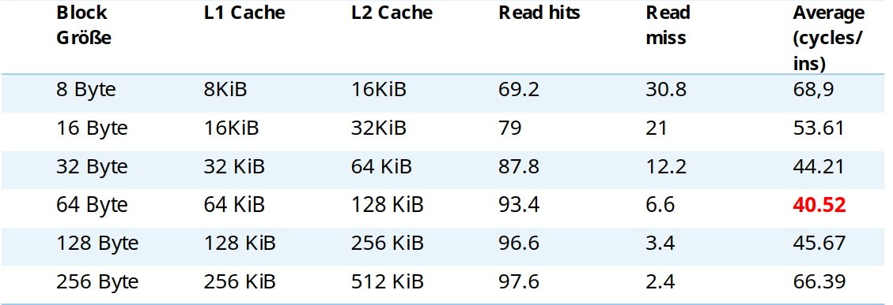

# Aufgabe

In diesem Projekt implementieren wir eine Simulation eines mehrstufigen direkt assoziativen Write-Through-Caches. Der Cache-Simulator unterstützt Lesen-/Schreiben-Operationen  von Daten und simuliert die Cache-Treffer und -Fehlerraten.

# Arbeitsteilung

- Ivan Logvynenko: 
	- CSV-parsing
	- Makefile
	- README.md
	- `run_simulation()`
- Nguyen Quoc Anh Pham: 
	- Cache-, Memory- und Controller-Module
	- `run_simulation()`
- Tuan Khang Nguyen: 
	- Args_parsing
    - Simulation testen
	- merge/quick-sort

## Aufbau

### Anforderungen

* gcc/++ oder clang/++ (default: gcc/++)
* Make
* SYSTEMC_HOME-Umgebungsvariable, die den Pfad zu Ihrer `systemc` Installation enthält

### Kompilieren und Ausführen

Um das Projekt zu kompilieren, führen Sie die folgenden Befehle aus:
``` bash
chmod +x ./build.sh
./build.sh
```

Dies startet die Kompilierung des Projekts. Alternativ können Sie das Projekt manuell kompilieren und ausführen:
``` bash
make
./cache
``` 

# Teilaugabenbeshreibung

## Argument Parsing

### [Implementierung](src/args_parser.c)
1. Verwendung von `getopt_long()`
- Verwendung der Funktion `getopt_long()` aus GNU C-Bibliothek, um die Kommandozeilenargumente zu parsen.
2. Fehlerbehandlung bei invaliden Optionen:
- **Invalid input type** - Eingaben sind nicht vom Typ Integer.
- `cacheLineSize`, `l1CacheLine` und `l2CacheLine` müssen Potenz of 2 sein.
- L1-Lines ≤ L2-Lines und L1-Latency ≤ L2-Latency < Memory-Latency.
- Permission read/write für Ein- und Ausgabedateien.
- Valider Pathname.
- Duplikate Optionen.
- Unbekannte Argumente: nur ein Argument erlaubt.

## CSV File parsing 

### [Implementierung](src/csv_reader.c)
1. File Öffnung und Validierung:
	* `fopen()` - Gibt einen Descriptor zurück.
	* `fstat(fileno(), stat)` - Füllt `struct stat` mit Datei über file. *Wichtig:* POSIX_C_SOURCE definieren
	* Überprüfen ob File ist leer.
	* fread() - Datei aus File in alokierten Buffer schreiben.
	* **Anmerkung:** jetzt soll char[] buffer voll mit Datei aus File sein.
2. Durch Zeilen cyclen:
	* Zählen die Mengevon Zeilen in File.
	* Mit `strtok()` Zeilen teilen.
	* Mit `sscanf()` Zeilen parsen.
	* Invalide Zeilen handeln.
3. Variablen dealokieren

## Cache und Module implementierungen
1. Cache
	* Verwaltet Cache-Zeilen, deren Initialisierung Lese- und Schreiboperationen.
	* Erhält nur Adressen, die mit der Cache-Line-Größe ausgerichtet sind.
	* Jede Cache-Operation wird nur auf einer Cache-Line durchgeführt. Falls für eine vom CPU angewiesene Access-Operation mehr als eine Cache-Line benötigt wird, wird die Verteilung der Arbeit durch den `CONTROLLER` gesteuert.
2. Memory
	* Verwendet eine `std::unordered_map`, um Daten dynamisch zu speichern.
	* Der Speicherplatz für einen Adressblock wird erst dann zugewiesen, wenn auf die Adresse zum ersten Mal zugegriffen wird.
3. Controller
	* Verwaltet 2 Cache-Module und ein Memory-Module.
	* Beginnt erst dann mit dem Zugriff auf die Speicher, wenn das `trigger`-Signal seinen Wert ändert.
	*  `done`-Signal wird auf true gesetzt, wenn der Zugriff abgeschlossen ist und das Modul für den nächsten Befehl bereit ist.

# Ergebnisse

## Analysieren und Testen ​

1. Zufällige Memory Zugriffsbefehlen
2. Rahmenprogramm
3. Durchführung von Algorithmen

## Average zufällige Memoryzugriffe​
 

## Cache Performance 

### Optimizationstrategie:​

* Reduzierung von Miss rate: größere Block Size, Cache Size​
* Reduzierung von Miss Penalty: multi-level Cache​

## Reele anwendungen

### Merge sort


### Quick sort

