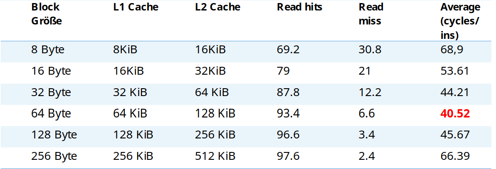
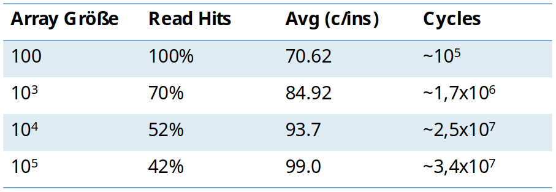
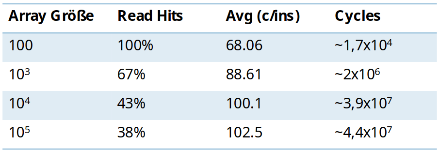

# Aufgabe

In diesem Projekt haben wir eine Simulation eines mehrstufigen direkt assoziativen Write-Through-Caches implementiert. Der Cache-Simulator unterstützt Operationen wie das Lesen und Schreiben von Daten und simuliert die Cache-Treffer und -Fehlerraten.

# Arbeitsteilung

- Ivan Logvynenko: 
	- CSV-parsing
	- Makefile
	- README.md
	- run_simulation
- Nguyen Quoc Anh Pham: 
	- Cache
	- run_simulation
- Tuan Khang Nguyen: 
	- Args_parsing
    - Simulation testen
	- merge/quick-sort

# Teilaugabenbeshreibung

## Argument Parsing

### [Implementierung](src/args_parser.c)
1. Verwendung von "getopt_long"
- Verwendung der Funktion "getopt_long" aus GNU C-Bibliothek, um die Kommandozeilenargumente zu parsen.
2. Fehlerbehandlung bei invaliden Optionen:
- **Invalid input type** für Zahlen: Input ist nicht type Integer type.
- Cacheline-size in Byte, L1-Cache-lines und L2-Cache-lines müssen Potenz of 2 
- L1-Lines ≤ L2-Lines und L1-Latency ≤ L2-Latency < Memory-Latency
- Permission read/write für Ein- und Ausgabedateien 
- Valider Pathname
- Duplikate Optionen.
- Unbekannte Argumente: 2. unbekannter Argument ist invalid.(1. ist input file)

## CSV File parsing 

### [Implementierung](src/csv_reader.c)
1. File Öffnung und Validierung:
	* fopen() - Gibt einen Descriptor zurück
	* fstat(fileno(), stat) - Füllt `struct stat` mit Datei über file *Wichtig:* POSIX_C_SOURCE definieren
	* Überprüfen ob File ist leer
	* fread() - Datei aus File in alokierten Buffer schreiben
	**Anmerkung:** jetzt soll char[] buffer voll mit Datei aus File sein
2. Durch Zeilen cyclen:
	* Zählen die Mengevon Zeilen in File
	* Mit strtok() Zeilen teilen
	* Mit sscanf() Zeilen parsen
	* Invalide Zeilen handeln
3. Variablen dealokieren

## Cache implementierung
<Placeholder fur Anh>

# Ergebnisse

## Analysieren und Testen ​

1. Zufällige Memory Zugriffsbefehlen
2. Rahmenprogramm
3. Durchführung von Algorithmen

## Average zufällige Memoryzugriffe​
 

## Cache Performance 

### Optimizationstrategie:​

* Reduzierung von Miss rate: größere Block Size, Cache Size​
* Reduzierung von Miss Penalty: multi-level Cache​

## Reele anwendungen

### Merge sort

### Quick sort

